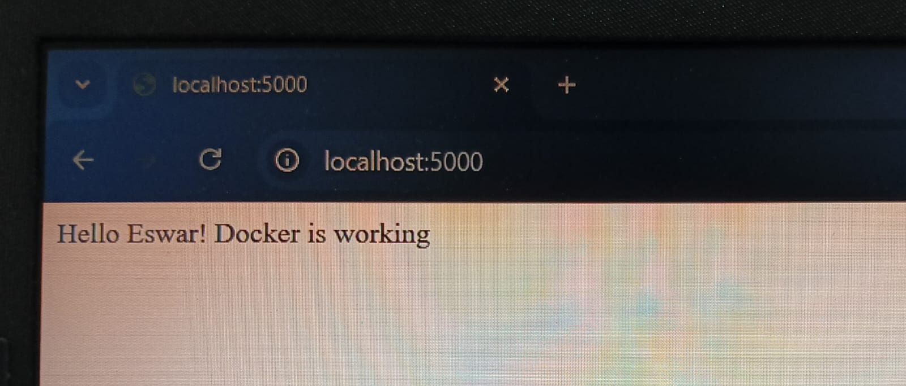

# 🚀 Dockerized Flask Application

---

## 📌 Project Overview

This project demonstrates how to containerize a simple Python Flask web application using Docker.

The application runs inside a Docker container and is exposed to the local machine using port mapping.

This project represents a complete end-to-end Docker workflow:

- Writing application code
- Creating a Dockerfile
- Building Docker images
- Running containers
- Pushing source code to GitHub
- Pushing Docker image to Docker Hub
- Pulling and running the image from Docker Hub

---

## 🛠️ Technologies Used

- Python 3.9  
- Flask  
- Docker  
- Docker Hub  
- Git & GitHub  

---

## 📂 Project Structure

docker-flask-app/
│
├── app.py
├── Dockerfile
├── requirements.txt
├── .gitignore
├── README.md
└── screenshots/
    └── output.png

---

# 🖥️ How To Run This Project (Build From Source)

### 1️⃣ Clone the Repository

git clone https://github.com/Gum-Eswar83/docker-flask-app.git  
cd docker-flask-app

---

### 2️⃣ Build Docker Image

docker build -t flask-docker-app .

This command:
- Reads the Dockerfile  
- Installs dependencies  
- Creates a Docker image  

---

### 3️⃣ Run the Container

docker run -p 5000:5000 flask-docker-app

This command:
- Starts the container  
- Maps container port 5000 to local port 5000  

---

### 4️⃣ Open in Browser

Open your browser and visit:

http://localhost:5000

---

# 🌍 Run Directly From Docker Hub

The image is publicly available on Docker Hub.

Docker Hub Repository:  
https://hub.docker.com/r/geswar83/flask-docker-app

---

### 1️⃣ Pull the Image

docker pull geswar83/flask-docker-app:1.0

---

### 2️⃣ Run the Container

docker run -p 5000:5000 geswar83/flask-docker-app:1.0

---

### 3️⃣ Open in Browser

http://localhost:5000

---

## ✅ Application Output

After running the container, the browser displays:

Hello Eswar! Docker is working

---

### 📷 Screenshot

---

# 📦 Docker Image Details

- Image Name: geswar83/flask-docker-app  
- Version: 1.0  
- Registry: Docker Hub  
- Publicly accessible  

---

# 🎯 Learning Outcomes

- Understanding Dockerfile creation  
- Building Docker images  
- Running containers  
- Port mapping  
- Docker image tagging  
- GitHub authentication using Personal Access Token  
- Pushing Docker images to Docker Hub  
- Pulling and running public Docker images  
- Complete end-to-end DevOps workflow  

---

# 🚀 Version

v1.0

---

## 👨‍💻 Author

Gumparlapati Eswar  

Aspiring DevOps Engineer  
Passionate about Cloud, Docker, and DevOps Technologies  

---

⭐ If you found this project helpful, feel free to give it a star!